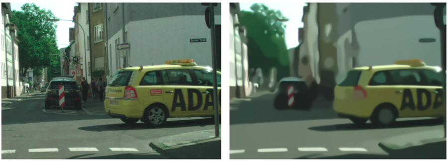

	
	 
	 
	

		<h2>
			<a href="https://link">Project Name</a>
			 
			Sub Name / Sentence
		</h2>
	

  

	
	

	

		

			
				<a href="https://link">Link to arXiv paper 📖</a>
			
		

		Special thanks to:
		 
		 
		<a href="link acm ai lab">
			

				
    			

			<b>ACM AI Lab</b>
			

				Research Project Conducted as part of the ACM AI Lab 
				Uncertainty quantification in deep learning
			

		</a>
		 
		 
		 
		<a href="https://link uni wuppertal">
			

				
			

			<b>Bergische Universität Wuppertal</b>
			

				In colaboration with Bergische Universität Wuppertal as part of School of Mathematics and Natural Sciences
			

		</a>
     
		 
		 
		<a href="link weitere partner">
			

				
			

			<b>Other partners</b>
			

				Explaining the colaboration with other partnets 
			

		</a>
		 
		 
	

	

	 
	 
	 
	 

	<a href="link">Abstract</a>&nbsp;&nbsp;&nbsp;
	<a href="link">Impact</a>&nbsp;&nbsp;&nbsp;
	<a href="link">Code</a>&nbsp;&nbsp;&nbsp;
	<a href="link">arxiv</a>&nbsp;&nbsp;&nbsp;

 
 

	short project description.

 
 
 

## Contents

- [Platforms](#platforms)

## Media

- [Creative Commons Media](https://github.com/shime/creative-commons-media#readme)
- [Fonts](https://github.com/brabadu/awesome-fonts#readme)
- [Codeface](https://github.com/chrissimpkins/codeface#readme) - Text editor fonts.
- [Stock Resources](https://github.com/neutraltone/awesome-stock-resources#readme)
- [GIF](https://github.com/davisonio/awesome-gif#readme) - Image format known for animated images.
- [Music](https://github.com/ciconia/awesome-music#readme)
- [Open Source Documents](https://github.com/44bits/awesome-opensource-documents#readme)
- [Audio Visualization](https://github.com/willianjusten/awesome-audio-visualization#readme)
- [Broadcasting](https://github.com/ebu/awesome-broadcasting#readme)
- [Pixel Art](https://github.com/Siilwyn/awesome-pixel-art#readme) - Pixel-level digital art.
- [FFmpeg](https://github.com/transitive-bullshit/awesome-ffmpeg#readme) - Cross-platform solution to record, convert and stream audio and video.
- [Icons](https://github.com/notlmn/awesome-icons#readme) - Downloadable SVG/PNG/font icon projects.

## Hardware

- [Robotics](https://github.com/Kiloreux/awesome-robotics#readme)

## Business

- [Open Companies](link)
- [Places to Post Your Startup](link)

## Work

- [Slack](link)
- [Communities](link)

## Networking

- [Software-Defined Networking](link)
- [PCAPTools](link)
- [Real-Time Communications](link)
- [SNMP](link) - A protocol for collecting, modifying, and organizing information about managed devices on IP networks.
- [Scapy](link) - Python-based interactive packet manipulation.

## Health and Social Science

- [Biomedical Information Extraction](link) - How to extract information from unstructured biomedical data and text.
- [Computational Neuroscience](link) - A multidisciplinary science which uses computational approaches to study the nervous system.

## Testing

- [Testing](link) - Software testing.

## Related

- [All Awesome Lists](link) - All the Awesome lists on GitHub.
- [Awesome Search](link) - Quick search for Awesome lists.
- [StumbleUponAwesome](link) - Discover random pages from the Awesome dataset using a browser extension.
- [Awesome CLI](link) - A simple command-line tool to dive into Awesome lists.
- [Awesome Viewer](link) - A visualizer for all of the above Awesome lists.
- [Track Awesome List](link) - View the latest updates of Awesome lists.
- [Open Source Heroes - Awesome](link) - View Awesome lists with extra info like stars, last update, and license.
